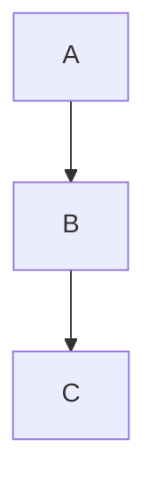

# Markdown Tool Support Matrix

This file answers: "can I use this extended element here?"

---

## Does GitLab support GitHub Flavored Markdown (GFM)?

**Yes.** GitLab Flavored Markdown (GLFM) is a strict superset of GFM:

> GLFM = CommonMark core + GFM extensions + GitLab-specific extensions

Source: <https://docs.gitlab.com/user/markdown/>

All valid GFM renders correctly in GitLab. GitLab adds further features
on top (see below). The converse is not true — some GitLab-only syntax
does not render on GitHub.

---

## Lightweight markup languages (supersets of Markdown)

| Language                                                      | Key extras over basic Markdown                                         |
| ------------------------------------------------------------- | ---------------------------------------------------------------------- |
| [CommonMark](https://commonmark.org)                          | Strict spec; no extended elements natively                             |
| [GFM](https://github.github.com/gfm/)                        | Tables, fenced code, strikethrough, task lists, footnotes, auto-links  |
| [GLFM](https://docs.gitlab.com/user/markdown/)                | GFM + alerts, Mermaid/PlantUML/Kroki, math (LaTeX), inline diffs, TOC  |
| [Markdown Extra](https://michelf.ca/projects/php-markdown/extra/) | Definition lists, footnotes, tables, heading IDs, fenced code     |
| [MultiMarkdown](https://fletcherpenney.net/multimarkdown/)    | Tables, footnotes, definition lists, sub/superscript, cross-references |
| [R Markdown](https://rmarkdown.rstudio.com/)                  | Code execution output, citations, LaTeX math                           |

---

## Feature support by platform

Legend: ✅ native · ⚠️ partial/HTML fallback needed · ❌ not supported

| Feature                   | GitHub (GFM) | GitLab (GLFM) | CommonMark only | README/docs (this repo) |
| ------------------------- | :----------: | :-----------: | :-------------: | :---------------------: |
| **Headings 1–6**          | ✅           | ✅            | ✅              | ✅                      |
| **Bold / italic**         | ✅           | ✅            | ✅              | ✅                      |
| **Blockquotes**           | ✅           | ✅            | ✅              | ✅                      |
| **Ordered / unordered lists** | ✅       | ✅            | ✅              | ✅                      |
| **Inline code**           | ✅           | ✅            | ✅              | ✅                      |
| **Fenced code blocks**    | ✅           | ✅            | ✅              | ✅                      |
| **Syntax highlighting**   | ✅           | ✅            | ⚠️ processor   | ✅                      |
| **Horizontal rules**      | ✅           | ✅            | ✅              | ✅                      |
| **Links & images**        | ✅           | ✅            | ✅              | ✅                      |
| **Tables**                | ✅           | ✅            | ❌              | ✅ (GFM renderer)       |
| **Strikethrough `~~`**    | ✅           | ✅            | ❌              | ✅                      |
| **Task lists `- [ ]`**    | ✅ (interactive) | ✅ (interactive) | ❌         | ✅ (rendered only)      |
| **Footnotes**             | ✅           | ✅            | ❌              | ✅                      |
| **Emoji shortcodes `:joy:`** | ✅        | ✅            | ❌              | ✅                      |
| **Auto-linked URLs**      | ✅           | ✅            | ❌              | ✅                      |
| **Heading IDs / anchors** | ✅ (auto)    | ✅ (auto)     | ⚠️ custom only | ✅                      |
| **Alerts / admonitions**  | ✅ (`> [!NOTE]`) | ✅ (`> [!NOTE]`) | ❌        | ✅                      |
| **Definition lists**      | ❌           | ✅ (v17.7+)   | ❌              | ❌                      |
| **Highlight `==`**        | ❌           | ❌            | ❌              | ❌                      |
| **Subscript `~`**         | ❌           | ❌            | ❌              | ❌                      |
| **Superscript `^`**       | ❌           | ❌            | ❌              | ❌                      |
| **Mermaid diagrams**      | ✅           | ✅            | ❌              | ❌                      |
| **PlantUML diagrams**     | ❌           | ✅            | ❌              | ❌                      |
| **Math (LaTeX / KaTeX)**  | ✅ (`$...$`) | ✅            | ❌              | ❌                      |
| **Multiline blockquote `>>>`** | ❌     | ✅            | ❌              | ❌                      |
| **Inline diffs `{+ +}`**  | ❌           | ✅            | ❌              | ❌                      |
| **Table of contents `[[_TOC_]]`** | ❌  | ✅            | ❌              | ❌                      |
| **GitLab references (`#123`, `@user`, `!MR`)** | ❌ | ✅       | ❌              | ❌                      |
| **JSON tables**           | ❌           | ✅ (v17.9+)   | ❌              | ❌                      |
| **Front matter (YAML)**   | ⚠️ ignored  | ✅            | ❌              | ❌                      |

---

## GitHub-specific: alerts / admonitions

Use the standard `> [!TYPE]` syntax — supported on both GitHub and GitLab
(GLFM adopted it). Types: `NOTE`, `TIP`, `IMPORTANT`, `WARNING`, `CAUTION`.

```markdown
> [!NOTE]
> This is a note.

> [!WARNING]
> This is a warning.

> [!TIP]
> Useful tip here.
```

---

## GitLab-only extras (GLFM)

Do not use these on GitHub; they will render as plain text or raw Markdown.

### Multiline blockquote

```markdown
>>>
A blockquote that spans
multiple lines without per-line `>` prefixes.
>>>
```

### Inline diffs

```markdown
- {+ added text +}
- [- removed text -]
```

### Mermaid diagrams

````markdown

````

### PlantUML diagrams

````markdown
```plantuml
Alice -> Bob : hello
```
````

### Math (LaTeX via KaTeX)

Inline: `` $a^2 + b^2 = c^2$ ``

Block:

```markdown
$$
\int_{0}^{\infty} e^{-x} dx = 1
$$
```

### Table of contents

```markdown
[[_TOC_]]
```

Renders a clickable TOC from all headings in the document.

### GitLab-specific references

```markdown
#123        issue or epic
!456        merge request
@username   mention a user
~label      label
%milestone  milestone
$snippet    snippet
```

Add `+` to show the title inline: `#123+`
Add `+s` for an extended summary: `#123+s`

### Inapplicable task list item

```markdown
- [~] This task is not applicable
```

---

## Choosing what to use

- **Writing for both GitHub and GitLab:** use GFM syntax. Avoid GitLab-only
  features (`>>>`, `{+ +}`, GLFM references, PlantUML, TOC, `[~]`).
- **Writing only for GitLab:** use the full GLFM feature set freely.
- **Writing for generic CommonMark:** stick to basic syntax + fenced code
  blocks and tables (the most portable extended features).
- **Highlight / sub / superscript needed:** use the HTML fallbacks (`<mark>`,
  `<sub>`, `<sup>`) on any platform that allows HTML.
